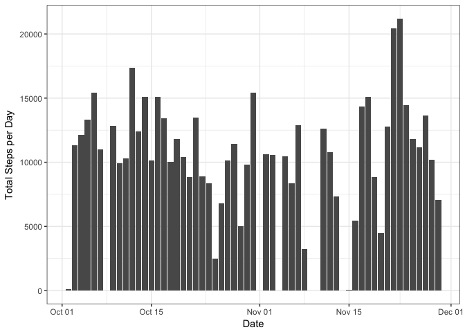
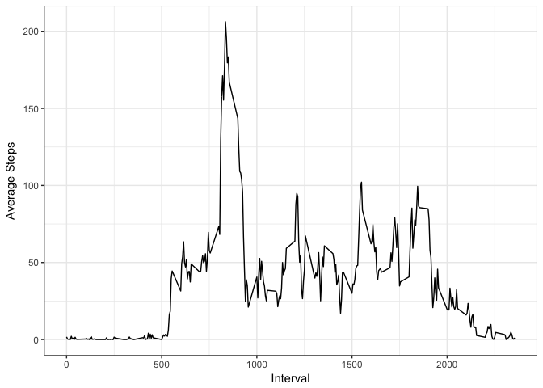
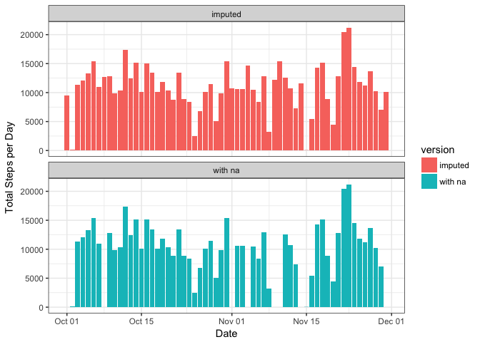
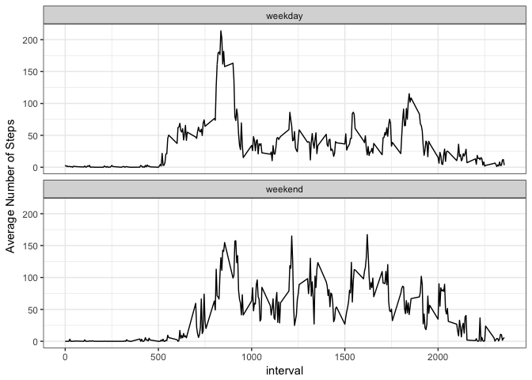

## Loading and preprocessing the data


##Mean Steps Per Day


```r
library(ggplot2)
g<-ggplot(data=total, aes(y=total$steps, x=total$date))
g+geom_col()+theme_bw()+labs(y="Total Steps per Day", x="Date")
```

<!-- -->

```r
mn<-mean(total$steps)
mdn<-median(total$steps)
```

The mean and median of the total number of steps taken per day are 10766.1886792453 and 10765 respectively

##Daily Activity Pattern


```r
int<-aggregate(steps~interval, data=steps, FUN=mean)
p<-ggplot(data=int, aes(y=int$steps, x=int$interval))
p+geom_line()+theme_bw()+labs(x="Interval", y="Average Steps")
```

<!-- -->

```r
max_int<-int$interval[max(int$steps)]
```

The average daily activity pattern is little to no activity between intervals 0-500. This corresponds to the middle of the night and early morning when people are often asleep. This is followed by a burst of activity in the morning between intervals 600-1000. After this burst in activity, the step number vacillates throughout the day centered around 50 total steps per interval until interval 2000. After interval 2000, the activity tapers off gradually to 0, again presumably as people go to bed.

The 5-minute interval, on average across all the days in the dataset, that contains the maximum number of steps is 1705

##Imputing Missing Values


```r
total_na<-length(which(is.na(steps$steps)))
```

The total number of missing "steps" values in the dataset is 2304

I'm going to use the package MICE (Multivariate Imputation via Chained Equations) to impute the missing data. MICE is one of the commonly used package by R users. Creating multiple imputations as compared to a single imputation (such as mean) takes care of uncertainty in missing values.

MICE assumes that the missing data are Missing at Random (MAR), which means that the probability that a value is missing depends only on observed value and can be predicted using them. It imputes data on a variable by variable basis by specifying an imputation model per variable.

The package uses a combination of linear regression and PMM (Predictive Mean Matching) for continuous numeric variables. It then provides 5 different data sets that differ only in the imputed variables. You can then randomly select 1 of the 5 datasets or combine the information from all 5. For simplicity, I have simply selected the second imputed date set.


```r
library(mice)
imputed<-mice(steps, m=5)
complete_steps<-complete(imputed, 2)
```


```r
total2<-aggregate(complete_steps$steps~complete_steps$date, FUN=sum)
names(total2)<-c("date", "steps")
total2$version<-"imputed"
mn2<-mean(total2$steps)
mdn2<-median(total2$steps)
```


After replacing missing values with imputed values, the mean total number of steps taken per day is 10944.6393442623 as compared to 10766.1886792453. The median total number of steps taken per day is 11015 as compared to 10765. In addition, while the gaps have been filled in by including imputed values, the shape of the histogram for total steps taken per day looks similar.


```r
compare<-rbind(total, total2)
b<-ggplot(data=compare, aes(y=steps, x=date, fill=version))
b+geom_col()+facet_wrap(~version, ncol=1, nrow=2)+theme_bw()+labs(y="Total Steps per Day", x="Date")
```

<!-- -->

##Weekday vs Weekend Activity


```r
complete_steps$weekday<-NA
for(i in 1:length(complete_steps$weekday)){
    if (weekdays(complete_steps$date[i])=="Saturday"){
        complete_steps$weekday[i]<-"weekend"}
    
    else if (weekdays(complete_steps$date[i])=="Sunday"){
        complete_steps$weekday[i]<-"weekend"}
    
    else {complete_steps$weekday[i]<-"weekday"}
}
week<-aggregate(steps~interval+weekday, data=complete_steps, FUN=mean)
w<-ggplot(data=week, aes(x=interval, y=steps))+geom_line()
w+facet_wrap(~weekday, ncol=1, nrow=2)+theme_bw()+labs(y="Average Number of Steps")
```

<!-- -->


The activity patterns vary between weekdays and weekends. Actvitiy starts much earlier during weekdays and has an obvious spike in steps. The weekends however have a more gradual increase in total steps and maintain generally higher levels of total steps throughout the day. Indeed both the mean and median total number of steps is higher on the weekends at 44.2371962 and 35.75 respectively compared to the mean and median for weekdays which are 35.7853395 and 27.4 respectively.
